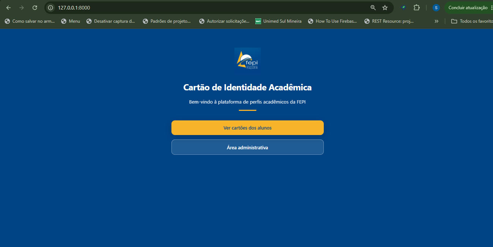
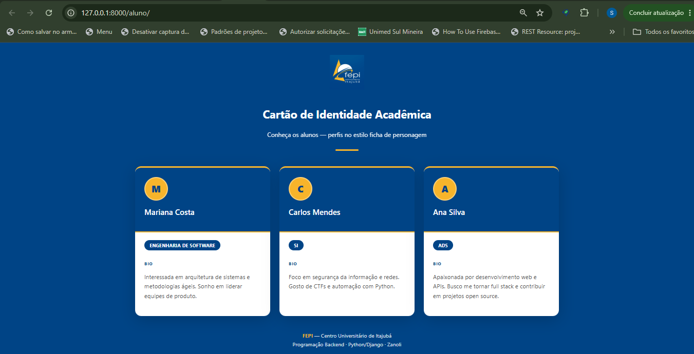
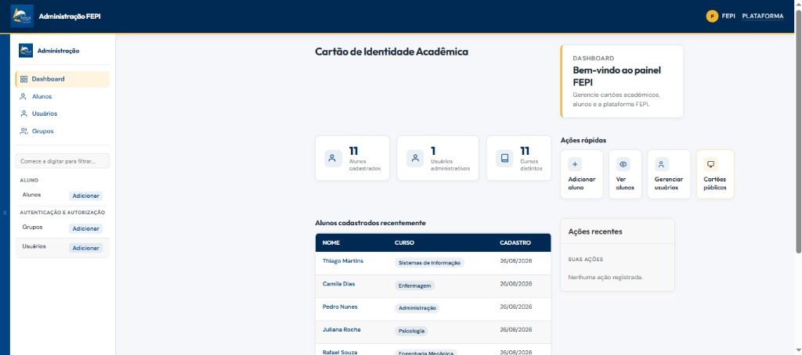

<div align="center">


# Cartão de Identidade Acadêmica

**Backend Django — Disciplina Programação Backend (Python/Django)**


*Sistema de perfis digitais no estilo ficha de personagem — Nome, Curso e Bio*

[🚀 Instalação](#-instalação-e-execução) ·
[🌐 Endpoints](#-endpoints) ·
[📸 Demonstração](#-demonstração)

</div>

---

## 📋 Sobre o projeto

A coordenação do curso decidiu modernizar a apresentação dos alunos no ambiente acadêmico. Em vez da tradicional carteirinha estática, este sistema oferece um **Cartão de Identidade Acadêmica digital**: cada aluno é representado por três informações centrais — **Nome**, **Curso** e **Bio**.

Desenvolvido como trabalho da disciplina **Programação Backend**, utilizando **Django** e **SQLite**.

---

##  Stack tecnológica

| Tecnologia | Uso |
|------------|-----|
| **Python 3.11+** | Linguagem principal |
| **Django 5.2** | Framework web backend |
| **SQLite** | Banco de dados |
| **HTML + CSS** | Front-end com cartões estilo ficha |

---

##  Pré-requisitos

- Python 3.11 ou superior
- Git (para clonar o repositório)

---

##  Instalação e execução

```powershell
# 1. Clone o repositório
git clone https://github.com/rafaeljs08/cartao-identidade-academica.git
cd cartao-identidade-academica

# 2. Crie e ative o ambiente virtual
python -m venv venv
.\venv\Scripts\python.exe -m pip install -r requirements.txt

# 3. Aplique as migrações do banco
.\venv\Scripts\python.exe manage.py migrate

# 4. (Opcional) Popule alunos de demonstração
.\venv\Scripts\python.exe manage.py seed_alunos

# 5. Inicie o servidor
.\venv\Scripts\python.exe manage.py runserver
```

> **Atalho no Windows:** dê duplo clique em `run.bat` para iniciar o servidor.

### Acessos no navegador

| Página | URL |
|--------|-----|
| 🏠 Página inicial | http://127.0.0.1:8000/ |
| 🎴 Cartões dos alunos | http://127.0.0.1:8000/aluno/ |
| ⚙️ Painel admin | http://127.0.0.1:8000/admin/ |

---

##  Cadastrar alunos

### Área pública (`/aluno/`)

CRUD completo **sem login**: criar, editar e excluir cartões diretamente na galeria.

### Painel administrativo (`/admin/`)

Dashboard moderno com KPIs, sidebar, alunos recentes e ações rápidas — **acesso direto, sem usuário e senha**.

1. Acesse http://127.0.0.1:8000/admin/
2. Use **Adicionar aluno** ou navegue em **Alunos**
3. Preencha **Nome**, **Curso** e **Bio** (máx. 280 caracteres) e salve

---

##  Endpoints

| URL | Método | Descrição |
|-----|--------|-----------|
| `/` | `GET` | Página inicial com acesso à plataforma |
| `/aluno/` | `GET` | Lista os cartões de identidade acadêmica |
| `/aluno/novo/` | `GET` / `POST` | Criar novo aluno |
| `/aluno/<id>/editar/` | `GET` / `POST` | Editar aluno |
| `/aluno/<id>/excluir/` | `GET` / `POST` | Excluir aluno |
| `/admin/` | `GET` | Painel administrativo com dashboard |

---

##  Modelo de dados — Aluno

| Campo | Tipo | Obrigatório | Descrição |
|-------|------|:-----------:|-----------|
| `nome` | CharField(100) | ✅ | Nome do aluno |
| `curso` | CharField(100) | ✅ | Curso (ex: ADS, SI, Engenharia) |
| `bio` | TextField(280) | ✅ | Breve descrição, interesses ou objetivos |
| `criado_em` | DateTimeField | — | Data de cadastro (automático) |

---

##  Demonstração

A aplicação possui uma interface para visualização dos alunos e uma área administrativa para gerenciamento dos registros.

### 🏠 Página inicial

Tela inicial da aplicação, com acesso aos cartões dos alunos e à área administrativa.



---

###  Cartões de Identidade Acadêmica

Página de visualização dos alunos cadastrados, mostrando nome, curso e biografia.



---

###  Painel Administrativo

Dashboard administrativo customizado com sidebar, KPIs, ações rápidas e tabela de alunos recentes.



---

##  Estrutura do projeto

```
cartao-identidade-academica/
├── manage.py
├── run.bat
├── requirements.txt
├── README.md
├── docs/
│   └── assets/
│       ├── fepi-logo.png
│       ├── demo-pagina-inicial.png
│       ├── demo-cartoes-alunos.png
│       └── demo-painel-admin.png
├── core/
│   ├── settings.py
│   ├── urls.py
│   └── views.py
├── templates/
│   ├── home.html
│   └── admin/
└── aluno/
    ├── models.py
    ├── views.py
    ├── urls.py
    ├── admin.py
    ├── tests.py
    ├── management/commands/seed_alunos.py
    ├── static/aluno/css/
    ├── static/aluno/js/
    └── templates/aluno/
```

---

##  Autor

**Rafael Junqueira de Souza**

Trabalho individual — **Programação Backend (Python/Django)**

**FEPI** — Centro Universitário de Itajubá

---

<div align="center">

*Desenvolvido com Django · 2026*

</div>
